# ChatbotEcommerce

Chatbot Ecommerce to aplikacja e-commerce zintegrowana z modułem NLP (spaCy) do obsługi zapytań klientów za pomocą chatbota. Projekt oparty jest na Django i składa się z dwóch głównych aplikacji:
- **core** – logika sklepu, obsługa koszyka, składanie zamówień, widoki front-endowe oraz modele produktów, zamówień, FAQ i klientów,
- **api** – REST API udostępniające operacje na produktach i zamówieniach, a także endpointy chatbota i rejestracji/logowania.

## Funkcjonalności

- **Panel administracyjny** – zarządzanie produktami, zamówieniami, FAQ i innymi zasobami.
- **Panel użytkownika (front-end)** – przeglądanie produktów, dodawanie do koszyka, składanie zamówień, rejestracja i logowanie.
- **Chatbot z NLP** – prosty moduł obsługi zapytań klientów z wykorzystaniem biblioteki [spaCy](https://spacy.io/), który rozpoznaje intencje użytkownika (np. zapytania o produkty, FAQ, informacje o dostawie) i odpowiada na nie dynamicznie.
Moglibyśmy wykorzystać w tym celu większy model np. Transfomers w celu bardziej szczegółówej analizy kontekstu zapytania użytkownika, ale jest to tylko projekt na studia, a Chatbot jest uroczym dodatkiem.
- **REST API** – udostępniające zestawy operacji (CRUD) na produktach i zamówieniach, a także dodatkowe funkcje (np. filtrowanie produktów po literze, zestawienie miesięczne zamówień).

## Instalacja i uruchomienie

1.Instalacja i uruchomienie
Sklonuj repozytorium GIT komendą (lub pobierz paczkę z plikami z GUI):

```
git clone https://github.com/maciejkondev/ChatbotEcommerce.git
cd ChatbotEcommerce
```

2.Zainstaluj wirtualne środowisko (opcjonalne, ale zalecane) i aktywuj je:

##### macOS/Linux
```
python -m venv venv
source venv/bin/activate  
```

##### Windows
```
python -m venv venv
venv\Scripts\activate     
```

3.Zainstaluj zależności (paczki):

```
pip install -r requirements.txt
```

4.Uruchom aplikację:

```
cd chatbot_ecommerce
python manage.py runserver
```

5.Aplikacja powinna być dostępna pod adresem: http://127.0.0.1:8000/ (aplikacja domyślnie przekieruje nas na stronę główną, również w wypadku nieistniejących URLi)

## Panel administracyjny
Aby zalogować się do panelu przejdź na stronę -> http://127.0.0.1:8000/admin/login/

poświadczenia superadmina:

username - admin

password - admin

## Panel użytkownika / GUI / front-end

Główna strona aplikacji -> http://127.0.0.1:8000/core/index/

Testowy użytkownik z gotową historią zamówień:

username - mkonieczny

password - Sstudent1

## Endpointy API

API aplikacji znajduje się pod adresem: http://127.0.0.1:8000/api/.

#### Główne endpointy:

- **/api/top-products/** – pobiera 3 produkty o największej dostępności (stock).

- **/api/products/** – operacje CRUD na produktach, w tym dodatkowy endpoint /api/products/by-letter/?letter=A do filtrowania po pierwszej literze.

- **/api/orders/** – operacje CRUD na zamówieniach, z dodatkową akcją /api/orders/monthly-summary (dostęp tylko dla administratora).

- **/api/chatbot/** – obsługa zapytań chatbota z wykorzystaniem NLP.

- **/api/register/** oraz **/api/login/** – endpointy rejestracji i logowania dla pobierania tokena.

## Uwagi
- Pliki statyczne CSS oraz szablony HTML znajdują się w katalogu **/core/static/** oraz **core/templates/core**.

- Skompresowane pliki produktów znajdują się w katalogu **/media/product_images/**

- Aplikacja wykorzystuje sesję do przechowywania zawartości koszyka – pamiętaj o aktywacji ciasteczek w przeglądarce.

- Weryfikacja logów, zapytań API oraz błędów następuje w aktywnej sesji konsoli


## Diagram Mermaid

```mermaid
graph TD;
    A[chatbot_ecommerce] -->|App| B(api);
    A -->|App| C(config);
    A -->|App| D(core);
    A --> E[db.sqlite3];
    A --> F[manage.py];
    A --> G[media];
    A --> H[README.md];
    A --> I[requirements.txt];
    
    B --> B1[__init__.py];
    B --> B2[admin.py];
    B --> B3[apps.py];
    B --> B4[models.py];
    B --> B5[tests.py];
    B --> B6[urls.py];
    B --> B7[views.py];
    
    C --> C1[__init__.py];
    C --> C2[asgi.py];
    C --> C3[settings.py];
    C --> C4[urls.py];
    C --> C5[wsgi.py];
    
    D --> D1[__init__.py];
    D --> D2[admin.py];
    D --> D3[apps.py];
    D --> D4[models.py];
    D --> D5[serializers.py];
    D --> D6[tests.py];
    D --> D7[urls.py];
    D --> D8[views.py];
    
    D --> D10[static];
    D10 --> D101[css];
    D101 --> D1011[styles.css];
    
    D --> D11[templates];
    D11 --> D111[core];
    D111 --> D1111[base.html];
    D111 --> D1112[cart.html];
    D111 --> D1113[checkout.html];
    D111 --> D1114[error.html];
    D111 --> D1115[index.html];
    D111 --> D1116[login.html];
    D111 --> D1117[profile.html];
    D111 --> D1118[register.html];
    
    G --> G1[product_images];
```


